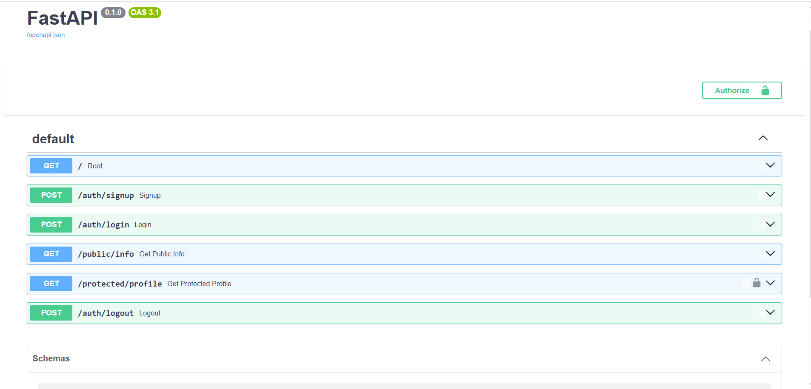
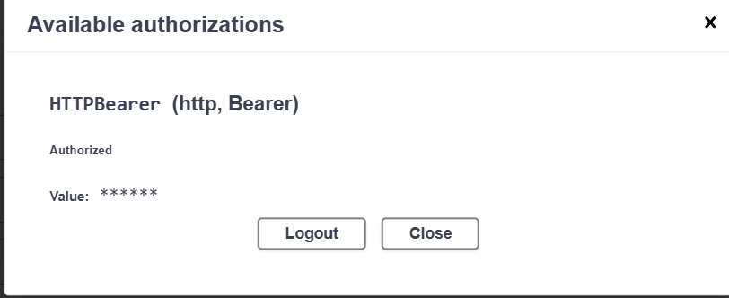

# FlyRank Backend Authentication API

A lightweight REST API built with **FastAPI** and **Supabase Authentication**. The project demonstrates a complete authentication flow including user registration, login, protected routes, Bearer token validation, reusable authentication dependencies, and interactive Swagger API documentation.

The project was developed as part of the FlyRank Backend Authentication Assignment, following a staged implementation approach from basic server setup through protected API endpoints and Swagger authentication.

## Features

* User registration with Supabase Authentication
* Email/password login
* JWT access and refresh token generation
* Protected API endpoints
* Bearer token authentication
* Reusable FastAPI authentication dependency
* Supabase token verification
* Interactive Swagger UI
* Swagger Bearer authentication support
* Environment-based configuration

## Tech Stack

* **Python**
* **FastAPI**
* **Uvicorn**
* **Supabase**
* **python-dotenv**
* **uv** for dependency and environment management

---

## Project Structure

```text
flyrank-backend-auth-assignment/
│
├── .env
├── .gitignore
├── main.py
├── auth.py
├── supabase_client.py
├── pyproject.toml
└── uv.lock
```

---

## Environment Setup

### 1. Create the `.env` file

Create a `.env` file in the project root:

```env
SUPABASE_URL=https://your-project-id.supabase.co
SUPABASE_KEY=your-anon-key
PORT=8000
```

### 2. Supabase configuration

The `SUPABASE_URL` and `SUPABASE_KEY` are obtained from your Supabase project's API settings.

For this practice project, email confirmation should be disabled in Supabase Authentication settings so newly registered users can immediately log in.

### 3. Keep secrets out of Git

The `.env` file should be included in `.gitignore`:

```gitignore
.env
```

Never commit Supabase credentials or other secrets to the repository.

---

## Installation

Install the project dependencies using `uv`:

```bash
uv add fastapi uvicorn supabase python-dotenv
```

---

## Running the Application

The application can be started with a single command:

```bash
uv run fastapi dev
```

Once running, the API will be available at:

```text
http://localhost:8000
```

The interactive Swagger documentation is available at:

```text
http://localhost:8000/docs
```

---

## API Reference

| Method | Endpoint             | Description                                          | Authentication |
| ------ | -------------------- | ---------------------------------------------------- | -------------- |
| `POST` | `/auth/signup`       | Register a new user                                  | ❌ No           |
| `POST` | `/auth/login`        | Authenticate a user and obtain access/refresh tokens | ❌ No           |
| `GET`  | `/public/info`       | Retrieve publicly accessible information             | ❌ No           |
| `GET`  | `/protected/profile` | Retrieve the authenticated user's profile            | ✅ Bearer Token |
| `POST` | `/auth/logout`       | Sign out the current authentication session          | ❌ No           |

> **Note:** The `/protected/profile` endpoint requires a valid Supabase access token in the `Authorization` header.

---

## Authentication Flow

### 1. Sign Up

Send a request to:

```http
POST /auth/signup
```

with:

```json
{
  "email": "user@example.com",
  "password": "Password123!"
}
```

A successful request creates the user through Supabase Authentication.

### 2. Login

Send credentials to:

```http
POST /auth/login
```

```json
{
  "email": "user@example.com",
  "password": "Password123!"
}
```

A successful login returns:

```json
{
  "access_token": "<access-token>",
  "refresh_token": "<refresh-token>"
}
```

Invalid credentials return:

```json
{
  "error": "Invalid login credentials"
}
```

with HTTP status `401`.

### 3. Access the Protected Profile

The access token must be supplied as a Bearer token:

```http
Authorization: Bearer <access-token>
```

The endpoint:

```http
GET /protected/profile
```

returns authenticated user information:

```json
{
  "id": "<user-id>",
  "email": "user@example.com",
  "created_at": "<timestamp>"
}
```

Invalid or expired tokens are rejected with HTTP `401`.

---

## Swagger UI

FastAPI automatically provides interactive API documentation through Swagger UI.

Open:

```text
http://localhost:8000/docs
```

The protected `/protected/profile` endpoint is configured with HTTP Bearer authentication, allowing the access token to be entered once through Swagger's **Authorize** button and reused when testing protected endpoints.

### Swagger Screenshot






The Swagger interface shows the available endpoints, authentication requirements, and the lock icon for protected routes.

---

## Security

Authentication is handled through **Supabase Auth**.

The protected profile endpoint uses a reusable FastAPI dependency to:

1. Extract the Bearer token.
2. Validate the token with Supabase.
3. Retrieve the authenticated user.
4. Inject the verified user into the protected route.
5. Reject invalid or expired tokens.

This prevents authentication logic from being duplicated across protected endpoints.

---

## Error Handling

The API handles common authentication failures including:

* Missing email or password
* Invalid login credentials
* Missing authentication credentials
* Invalid or expired access tokens

Protected resources are inaccessible without a valid access token.

---

## Example Authentication Flow

```text
Client
  │
  ├── POST /auth/signup
  │        │
  │        └── Create Supabase user
  │
  ├── POST /auth/login
  │        │
  │        └── Receive access_token
  │
  └── GET /protected/profile
           │
           ├── Bearer access_token
           │
           ├── FastAPI authentication dependency
           │
           ├── Supabase token verification
           │
           └── Return authenticated user
```

---

## Project Status

**Completed**

* Server and Supabase client setup
* User registration
* User login
* Protected profile endpoint
* Supabase access-token verification
* Reusable authentication dependency
* Swagger UI Bearer authentication
* API documentation
